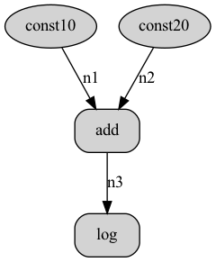
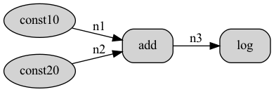

# dagviz

## Introduction

`dagviz` can visualize a graph.

## Install

```Bash
pip install -r requirements.txt
```

## Usage

```bash
usage: dagviz.py [-h] -i INPUT_FILE -o OUTPUT_FILE [-d {LR,RL,TB,BT}]

DAG visualization tool

optional arguments:
  -h, --help            show this help message and exit
  -i INPUT_FILE, --input_file INPUT_FILE
                        dag json file path
  -o OUTPUT_FILE, --output_file OUTPUT_FILE
                        output image file
  -d {LR,RL,TB,BT}, --direction {LR,RL,TB,BT}
                        direction of the graph, default is TB
```

## Examples

```bash
python dagviz.py -i demo.json -o demo_tb.png
python dagviz.py -i demo.json -o demo_lr.png -d LR
```

demo_tb.png



demo_lr.png


